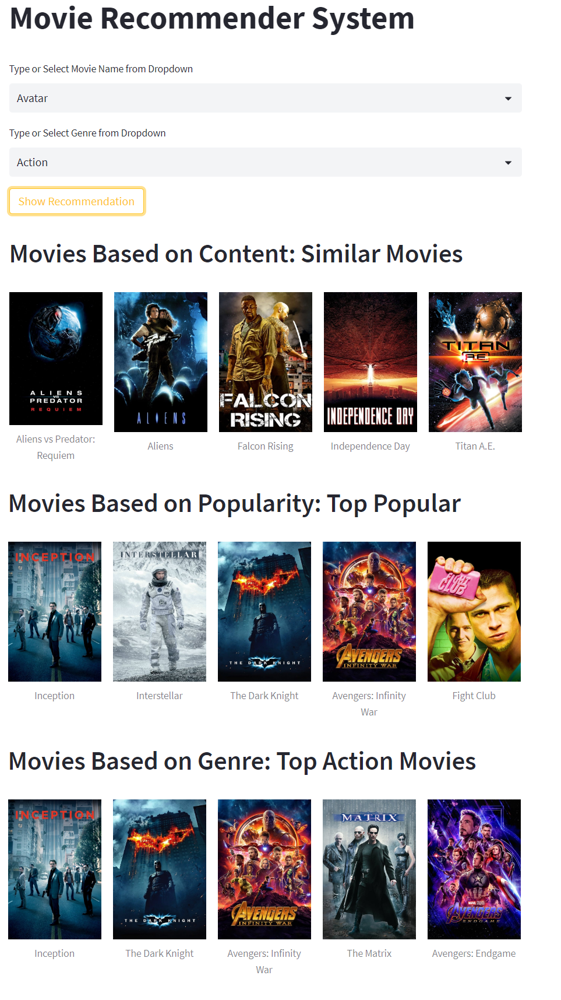

# Movie Recommender System
This notebook is trying to build a model which will recommend the movie based on given movie and genre. In this we use Popularity Based Recommendation, Content Based Recommendation and Collaborative Filtering based Recommendation. 
The dataset is taken from <a href="https://www.kaggle.com/datasets/sunayanagawde/tmdb-popular-10000-movies-dataset">Kaggle: TMDB Popular 10000 Movies Dataset</a> which is compiled by using the api of TMDB. 
You can follow the analysis on <a href="https://www.kaggle.com/code/shrikrishnaparab/movie-recommender-system">Kaggle</a>  

## Packeges Used:
 ![Python][python] ![scikit-learn][sklearn-image] ![Pandas][Pandas-image]  ![Jupyter Notebook][ipython-image] 
 
[python]: https://img.shields.io/badge/python-3670A0?style=for-the-badge&logo=python&logoColor=ffdd54
[sklearn-image]:https://img.shields.io/badge/scikit--learn-%23F7931E.svg?style=for-the-badge&logo=scikit-learn&logoColor=white
[Pandas-image]: https://img.shields.io/badge/pandas-%23150458.svg?style=for-the-badge&logo=pandas&logoColor=white
[ipython-image]: https://img.shields.io/badge/jupyter-%23FA0F00.svg?style=for-the-badge&logo=jupyter&logoColor=white

## Deployment:
Streamlit is used to build a front-end of the web application for Movie Recommender System and is deployed on huggingface.co.

### Check the app:

